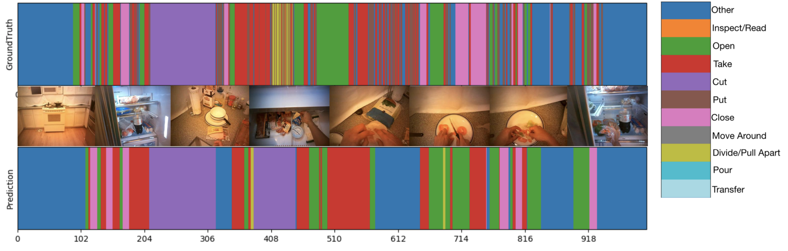

# Videos - Action Recognition

  

For more details, please view "hw4_R07921052.pdf" for results and experiments.

# Usage
To start working on this assignment, you should clone this repository into your local machine by using the following command.

    git clone https://github.com/dlcv-spring-2019/hw4-<username>.git
Note that you should replace `<username>` with your own GitHub username.

For this dataset, the action labels are defined as below:

|       Action      | Label |
|:-----------------:|:-----:|
| Other             | 0     |
| Inspect/Read      | 1     |
| Open              | 2     |
| Take              | 3     |
| Cut               | 4     |
| Put               | 5     |
| Close             | 6     |
| Move Around       | 7     |
| Divide/Pull Apart | 8     |
| Pour              | 9     |
| Transfer          | 10    |

### Utility
We have also provided a Python script for reading video files and retrieving labeled videos as a dictionary. For more information, please read the comments in [`reader.py`](reader.py).

### Submission Format
Aside from your own Python scripts and model files, you should make sure that your submission includes *at least* the following files in the root directory of this repository:
 1.   `hw4_<StudentID>.pdf`  
The report of your homework assignment. Refer to the "*Grading*" section in the slides for what you should include in the report. Note that you should replace `<StudentID>` with your student ID, **NOT** your GitHub username.
 1.   `hw4_p1.sh`  
The shell script file for data preprocessing. This script takes as input two folders: the first one contains the video data, and the second one is where you should output the label file named `p1_valid.txt`.
 1.   `hw4_p2.sh`  
The shell script file for trimmed action recognition. This script takes as input two folders: the first one contains the video data, and the second one is where you should output the label file named `p2_result.txt`.
 1.   `hw4_p3.sh`  
The shell script file for temporal action segmentation. This script takes as input two folders: the first one contains the video data, and the second one is where you should output the label files named `<video_category>.txt`. Note that you should replace `<video_category>` accordingly, and a total of **7** files should be generated in this script.

We will run your code in the following manner:

**Problem 1**

    bash ./hw4_p1.sh $1 $2 $3
-   `$1` is the folder containing the ***trimmed*** validation videos (e.g. `TrimmedVideos/video/valid/`).
-   `$2` is the path to the ground truth label file for the videos (e.g. `TrimmedVideos/label/gt_valid.csv`).
-   `$3` is the folder to which you should output your predicted labels (e.g. `./output/`).

**Problem 2**

    bash ./hw4_p2.sh $1 $2 $3
-   `$1` is the folder containing the ***trimmed*** validation/test videos.
-   `$2` is the path to the ground truth label file for the videos (e.g. `TrimmedVideos/label/gt_valid.csv` or `TrimmedVideos/label/gt_test.csv`).
-   `$3` is the folder to which you should output your predicted labels (e.g. `./output/`).

**Problem 3**

    bash ./hw4_p3.sh $1 $2
-   `$1` is the folder containing the ***full-length*** validation videos.
-   `$2` is the folder to which you should output your predicted labels (e.g. `./output/`).

